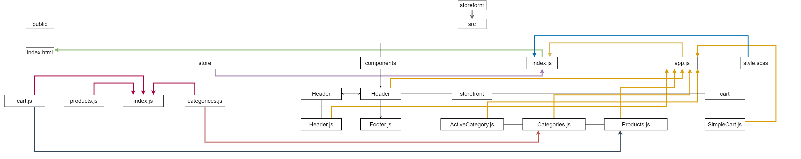

# Lab: Class 37

## Index

- [LAB - Hooks API](#LAB---Hooks-API)
- [Business Requirements](#Business-Requirements)
- [Phase 2 Requirements](#Phase-2-Requirements)
- [Technical Requirements / Notes](#Technical-Requirements-/-Notes)
- [The lab tree](#The-lab-tree)
- [More about the Lab](#More-about-the-Lab)
  - [Author](#Author)
  - [Github](#Github)
  - [UML](#UML)
  - [App](#App)
  - [Deployment link](https://storefront-401.netlify.app/)
- [Author Links](#Author-Links)
- [Back to main README](../../../README.md)
- [Back to head or the repo](https://github.com/shadykh/storefront)

---

# Lab: Redux - Combined Reducers

**Virtual Store Phase 2:**  Continue work on the e-Commerce storefront, breaking up the store into multiple reducers and sharing functionality/data between components

**[⬆ Back to Index](#index)**

---

## Before you begin

Refer to *Getting Started*  in the [lab submission instructions](../../../reference/submission-instructions/labs/README.md) for complete setup, configuration, deployment, and submission instructions.

> Continue working in your 'storefront' repository, in a branch called 'combined-reducers'

**[⬆ Back to Index](#index)**

---

## Business Requirements

Refer to the [Virtual Store System Overview](../../../README) for a complete review of the application, including Business and Technical requirements along with the development roadmap.

**[⬆ Back to Index](#index)**

---

## Phase 2 Requirements

In phase 2, we will be adding the "Add to Cart" feature to our application, which will allow our users to not only browse items in the store, but also select them and have them persist in their "shopping cart" for later purchase.

The user stories from Phase 1 remain unchanged. For this phase, we are now adding the following new user stories to meet the new requirements.

- As a user, I want to choose from products in the list and add them to my shopping cart
- As a user, I want to see the products that I've added to my shopping cart so that
- As a user, I want to change the quantity of items I intend to purchase in my shopping cart
- As a user, I want to be able to remove an item from my shopping cart

Application Flow:

- User sees a list of categories
- ... Chooses a category and sees a list of products
- ... Clicks the  "Add to Cart" button on any product
- ... Clicks the "Cart" link in the header
- ... Sees a list of all products in the cart
- ... Clicks the delete button on an item and sees the item removed
- ... Changes the quantity selector on an item and sees the cart total change


**[⬆ Back to Index](#index)**

---


## Technical Requirements / Notes

And as developers, here are the high level development tasks that address the above end user requirements and workflow

- Continue to use Material UI Components for layout and styling
- Add a "Cart" indicator to the header, like this: **Cart (0)**
- Create a new Cart component to show the items in the user's cart

### Application Architecture

- Add a new component to the page: `<SimpleCart />`
  - Displays a short list (title only) of products in the cart
  - This should be present at all times
- Home Page Operation:
  - When the user selects (clicks on) a category ...
    - Identify that category as selected
    - Show a list of products associated with the category, that have a quantity > 0
    - Add an "add to cart" button to each product
  - When a user clicks the "add to cart" button add the item to their cart
    - In the `<SimpleCart/>` component, show a running list of the items in the cart (just the titles)
    - Change the `(0)` indicator in the header to show the actual number of items in the cart
    - Reduce the number in stock for that product

### Manage state in a Redux store with multiple reducers/actions

- Categories
  - State should be a list of categories as well as the active one
    - Each category should have a normalized name, display name, and a description
  - Create an action that will trigger the reducer to change the active category
  - Update the active category in the reducer when this action is dispatched
- Products
  - State should be a list of all products
    - Each product should have a category association, name, description, price, inventory count
  - Create an action that will trigger the reducer to filter the product list when the active category is changed
    - HINT: Different reducers can respond to the same actions
  - Create a reducer that will filter the products list based on the active category
  - Create an action that will trigger the reducer to reduce the stock counter
  - Create a reducer that reduces the # in stock when that action is dispatched
- Cart
  - State should be an array of products that have been added (all product details)
  - Create an action that will trigger the reducer to add the selected item to the cart
    - **Hint:** this could be the same action type as you create for the Products reducer
  - Create a reducer that adds the product to the array of items in state

**[⬆ Back to Index](#index)**


---

#### **The lab tree**

```
├── .gitignore
├── .eslintrc.json
├── __tests__
│   ├── app.test.js
│   ├── cart.test.js
├── src
│   ├── index.js
│   ├── app.js
│   ├── store
│   │   ├── index.js
│   │   ├── categories.js
│   │   ├── products.js
│   │   ├── cart.js
│   ├── components
│   │   ├── storefront
│   │   │   └── categories.js
│   │   │   └── current-category.js
│   │   │   └── products.js
│   │   │   └── storefront.js
│   │   ├── products
│   │   │   └── details.js
│   │   ├── cart
│   │   │   └── simplecart.js
│   │   │   └── checkout.js
│   │   ├── header
│   │   │   └── header.js
│   │   ├── footer
│   │   │   └── footer.js
└── package.json
```

**[⬆ Back to Index](#index)**


---


### **More about the Lab**

- #### Author

  - Shady Khaled

  **[⬆ Back to Index](#index)**

---


- #### Github

  - For the repo ***storefront*** clicks => [here](https://github.com/shadykh/storefront).
  - Pull Requests:
    - [https://github.com/shadykh/storefront/pull/8](https://github.com/shadykh/storefront/pull/8)

**[⬆ Back to Index](#index)**

---


- #### UML

  - 

**[⬆ Back to Index](#index)**

---


- #### App

  - run `npm start`
  - Deployment link 🌍: [storefront](https://storefront-401.netlify.app/)

- I did this lab with help of
  - dependencies
    - node-sass
    - react
    - react-dom
    - react-scripts
    - web-vitals
  - framework
    - Node.js
    - React
  - tools
    - Github.
    - VsCode.
    - Ubuntu.

**[⬆ Back to Index](#index)**

<br>

---
<br>

## Author Links

- ### Shady Khaled github ✅

  - [Shady Khaled](https://github.com/shadykh)

- ### Shady Khaled reading notes 📚

  - [Shady Khaled reading notes](https://shadykh.github.io/reading-notes/)

- ### Shady Khaled portfolio 💬

  - [Shady Khaled portfolio](https://portfolio-shady.herokuapp.com/)
