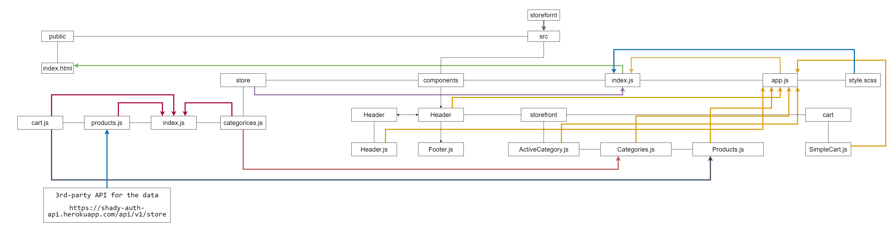

# Lab: Class 38

## Index

- [LAB - Hooks API](#LAB---Hooks-API)
- [Business Requirements](#Business-Requirements)
- [Phase 3 Requirements](#Phase-3-Requirements)
- [Technical Requirements / Notes](#Technical-Requirements-/-Notes)
- [The lab tree](#The-lab-tree)
- [More about the Lab](#More-about-the-Lab)
  - [Author](#Author)
  - [Github](#Github)
  - [UML](#UML)
  - [App](#App)
  - [Deployment link](https://storefront-401.netlify.app/)
- [Author Links](#Author-Links)
- [Back to main README](../../../README.md)
- [Back to head or the repo](https://github.com/shadykh/storefront)

---

# LAB - Redux - Asynchronous Actions

**Virtual Store Phase 3:**  Connect the Virtual Store to an API to retrieve live data from your data source, using `thunk` to enable asynchronous actions

**[⬆ Back to Index](#index)**

---

## Before you begin

Refer to *Getting Started*  in the [lab submission instructions](../../../reference/submission-instructions/labs/README.md) for complete setup, configuration, deployment, and submission instructions.

> Continue working in your 'storefront' repository, in a branch called 'thunk'

**[⬆ Back to Index](#index)**

---

## Business Requirements

Refer to the [Virtual Store System Overview](../../../README) for a complete review of the application, including Business and Technical requirements along with the development roadmap.

**[⬆ Back to Index](#index)**

---

## Phase 3 Requirements

In phase 3, we will be connecting our Virtual Store to a live API so that our data is persistent and able to be separately managed.

The user stories from Phases 1 and 2 remain unchanged. For this phase, we are now adding the following new user stories to meet the new requirements.

- As a user, I want to interact with live inventory so that I have confidence that the displayed products are in stock
- As a user, I want to know to that when I add an item to my cart, that it is removed from inventory so that no other users can purchase it

**[⬆ Back to Index](#index)**

---

## Technical Requirements / Notes

And as developers, here are the high level development tasks that address the above end user requirements and workflow

- Continue to use Material UI Components for layout and styling
- Load the category and product list from a remote API on page load.
- Update the product quantity in stock when adding items to (or removing from) the cart
- Continue to use multiple reducers

### Notes on State Management

- You will need to use `useEffect()` to dispatch a load action on the initial page load
  - This will need to use `thunk` as it will be asynchronous
- When adding/removing/updating items in the cart, the action/reducer will need to update the server
  - Perform the appropriate `post`, `put`, or `delete` action via API call (using thunk in an async action) on each of these actions as performed by the users

> **NOTE:** When write operations happen in the cart, the products are changed permanently (inventory count changes on the server), your product list in state will be instantly out of sync with what's on the server. How (or when) will you re-sync the state of your application with the state of the persisted data on the server?  Remember that an earlier requirement is to ensure that only products that have an available inventory of > 0 can be shown on the application as users browse the categories.


**[⬆ Back to Index](#index)**


---

#### **The lab tree**

```
├── .gitignore
├── .eslintrc.json
├── __tests__
│   ├── app.test.js
│   ├── cart.test.js
├── src
│   ├── index.js
│   ├── app.js
│   ├── store
│   │   ├── index.js
│   │   ├── categories.js
│   │   ├── products.js
│   │   ├── cart.js
│   ├── components
│   │   ├── storefront
│   │   │   └── categories.js
│   │   │   └── current-category.js
│   │   │   └── products.js
│   │   │   └── storefront.js
│   │   ├── products
│   │   │   └── details.js
│   │   ├── cart
│   │   │   └── simplecart.js
│   │   │   └── checkout.js
│   │   ├── header
│   │   │   └── header.js
│   │   ├── footer
│   │   │   └── footer.js
└── package.json
```

**[⬆ Back to Index](#index)**


---


### **More about the Lab**

- #### Author

  - Shady Khaled

  **[⬆ Back to Index](#index)**

---


- #### Github

  - For the repo ***storefront*** clicks => [here](https://github.com/shadykh/storefront).
  - Pull Requests:
    - [https://github.com/shadykh/storefront/pull/11](https://github.com/shadykh/storefront/pull/11)

**[⬆ Back to Index](#index)**

---


- #### UML

  - 

**[⬆ Back to Index](#index)**

---


- #### App

  - run `npm start`
  - Deployment link 🌍: [storefront](https://storefront-401.netlify.app/)

- I did this lab with help of
  - dependencies
    - node-sass
    - react
    - react-dom
    - react-scripts
    - web-vitals
  - framework
    - Node.js
    - React
  - tools
    - Github.
    - VsCode.
    - Ubuntu.

**[⬆ Back to Index](#index)**

<br>

---
<br>

## Author Links

- ### Shady Khaled github ✅

  - [Shady Khaled](https://github.com/shadykh)

- ### Shady Khaled reading notes 📚

  - [Shady Khaled reading notes](https://shadykh.github.io/reading-notes/)

- ### Shady Khaled portfolio 💬

  - [Shady Khaled portfolio](https://portfolio-shady.herokuapp.com/)
